# TryHackMe-Creative

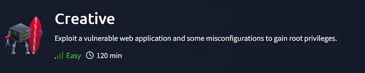

## Port Scan

As always, we start off with an NMAP scan:

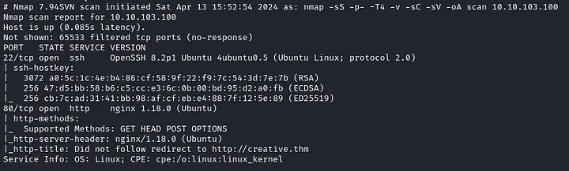

The scan shows that SSH is listening on port 22, and a web server on port 80. We also see a domain name “creative.thm”, so we can add that to our /etc/hosts file .

## creative.thm


I’m not going to bother you with the details of this website, since it’s just static HTML. No robots.txt, nothing in the source code, and gobuster only finds /assets which leads to a 403 forbidden message.

Let’s look for any subdomains:

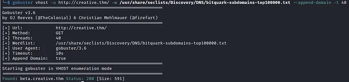

Gobuster finds the “beta.creative.thm” subdomain very quickly.

Again, we can add it to our /etc/hosts file and check it out.

## beta.creative.thm

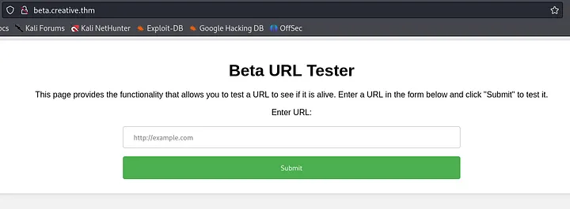

The page does a pretty good job of explaining what it does. Let’s see if we can hit our local machine with it.

I’ll create a file called “index.html” with random text in it:

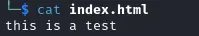

Then, we can host this file on a webserver, and submit our IP as the URL:

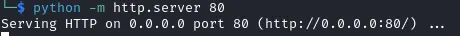

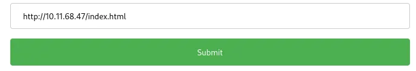

And indeed! The server reaches back to us and grabs the index.html file.

At this point I spent some time reading about SSRF attacks and how to escalate them to RCE, but couldn’t really make anything work. Simply hosting a malicious PHP script doesn’t actually do anything, since the website just displays the source of page requested.

Finally, I decided to use this vulnerability to enumerate the machine further.

If we make a request to [localhost](http://localhost) via the website, we get the HTML of the creative.thm website:


What if we try http://localhost:port to see if there are any other HTTP services that are not accessible from outside?

To do this quickly, I’ll use a custom python script. This is totally possible to do via Burp Intruder, but it works very slowly with the free version of Burp.

Here is the python script:

```python 
import requests
import urllib.parse
from concurrent.futures import ThreadPoolExecutor

def send_post_request(url, payload, headers):
    try:
        response = requests.post(url, data=payload, headers=headers)
        content_length = response.headers.get('Content-Length')
        if content_length != '13':  # Check if content length isn't 13
            print(f"POST request to {url} with payload {payload} returned status code: {response.status_code}, content length: {content_length}")
    except requests.exceptions.RequestException as e:
        print(f"Error sending POST request: {e}")

def main():
    base_url = "http://beta.creative.thm"
    headers = {
        "Host": "beta.creative.thm",
        "User-Agent": "Mozilla/5.0 (X11; Linux x86_64; rv:109.0) Gecko/20100101 Firefox/115.0",
        "Accept": "text/html,application/xhtml+xml,application/xml;q=0.9,image/avif,image/webp,*/*;q=0.8",
        "Accept-Language": "en-US,en;q=0.5",
        "Accept-Encoding": "gzip, deflate, br",
        "Content-Type": "application/x-www-form-urlencoded",
        "Origin": "http://beta.creative.thm",
        "Connection": "close",
        "Referer": "http://beta.creative.thm/",
        "Upgrade-Insecure-Requests": "1"
    }

    # Using ThreadPoolExecutor to run 20 threads concurrently
    with ThreadPoolExecutor(max_workers=20) as executor:
        for port_number in range(1, 65536):
            url = f"http://localhost:{port_number}"
            payload = f"url=http%3A%2F%2Flocalhost%3A{port_number}"
            executor.submit(send_post_request, base_url, payload, headers)

if __name__ == "__main__":
    main()
```

Now, this might look a bit scary, but there’s really not much to this script.

We will loop through every port number, from 1 to 65535, and send that as the POST body to[http://beta.creative.thm/](http://beta.creative.thm/) The script will then print out only responses that don’t return a content length of 13, since that’s the content length of the response we get from the server for something it couldn’t connect to:

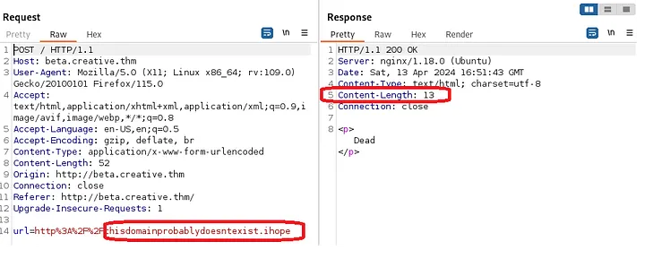

As for the headers that you see in the script, it’s just the headers I copied from a request I captured with burp.

Now, we can run the script:

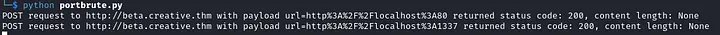

We can see that port 80 returns a different content-length, which is expected. However, port 1337 also doesn’t return a content-length of 13…

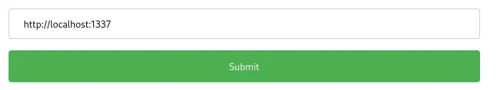

Bingo! We have another web service that seems to have Directory-listing enabled. To better understand how it works, try hosting one yourself! You can do that by navigating to the ‘/’ directory on your kali and running

```bash 
python -m http.server 1337
```

Then when you browse to [http://localhost:1337](http://localhost:1337) you should see a directory listing of your entire file system.

#IMPORTANT : Exposing your entire file system on a web-server is totally unsafe, so only do this in a safe lab environment!
So, if the file system is hosted here, maybe we can access /etc/passwd?

Press enter or click to view image in full size

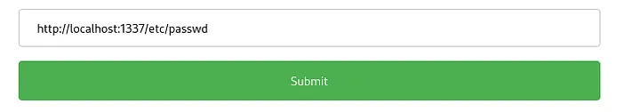

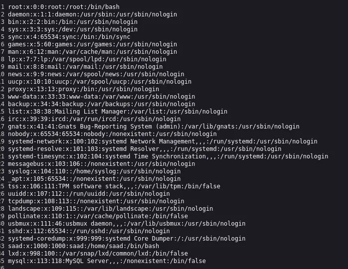

Nice, we learn about a user called “saad” (UID 1000)!

But , we still don’t have access to the machine. Maybe we can find Saad’s SSH key and use it to login via SSH?

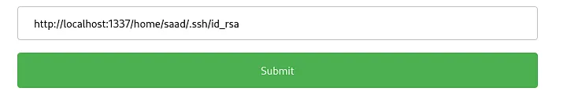

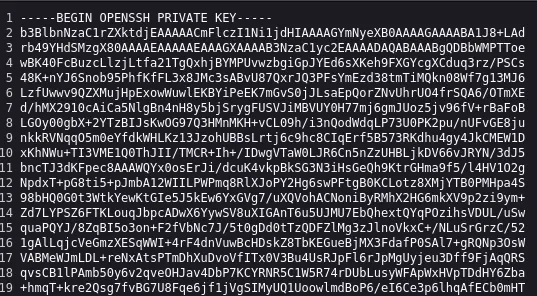

Bingo! Let’s save the key to our machine and try to login:

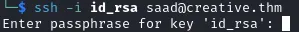

Hmm…The key is protected with a passphrase. We can try to use “John” to crack the passphrase. First, we need to translate the key into a hash that john can understand:


Now, we can try to crack it with the rockyou.txt wordlist:

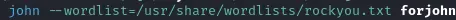

I already cracked it on my machine, so I’ll use “ — show” to view the cracked passphrase:

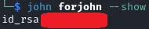

Wonderful! We now have the passphrase for the key. Let’s login:

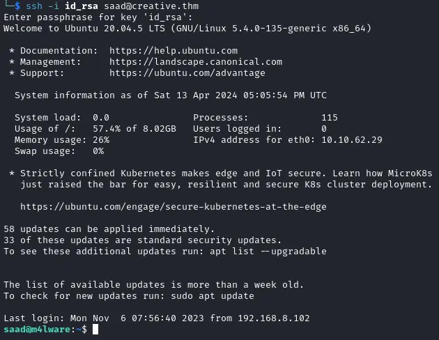

The user flag can be found at /home/saad/user.txt !

## Privilege Escalation

First things first, let’s check sudo -l since it’s a low hanging fruit:

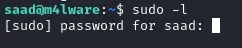

Hmm, we don’t have Saad’s password. We can try to see if he reused the same password from the key’s passphrase, but that doesn’t work.

A good place to look for passwords , is inside history files. Let’s check the .bash_history file inside Saad’s home directory:

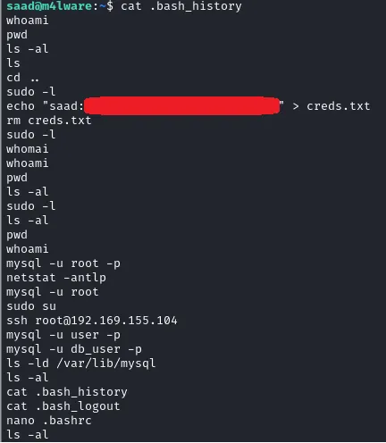

And we find a password! Using this password we can now run sudo -l:

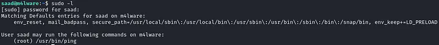

We can see that Saad can run “ping” as root. But that doesn’t really help us, as ping isn’t a binary that can be abused to escalate our privileges. (You can kind of understand that from the fact that “ping” doesn’t have an entry on [GTFOBins](https://gtfobins.github.io/))

But, there is one very important part in the output from sudo -l, which you might have missed if you haven’t used it for privilege escalation before:

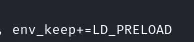

What’s this?

By Simply googling “LD_PRELOAD” we get our answer:

```text
LD_PRELOAD is an optional Environment Variable that is used to set/load Shared Libraries to a program or script. That means we can set the value of the LD_PRELOAD Environment Variable for a program to tell the program to load the mentioned libraries in it’s memory before starting.
```

First, we create a shell.c file in /tmp (doesn’t have to be in /tmp , but placing exploits in /tmp to avoid detection by the real users is good practice):

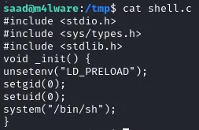

This is a very simple C code that simply sets the UID and GID to 0 (root), and then spawns a shell.

Next, we compile the code with “gcc” and specify that this is a shared library:

```bash
gcc -fPIC -shared -o shell.so shell.c -nostartfiles
```

You will get a few warning messages which you can just ignore.

Now, all that we have to do, is to run “sudo ping” while setting the environmental variable “LD_PRELOAD” to the path of our malicious library.

Before ping is executed, the library will be loaded , and since we are running this with sudo, we should be able to get a root shell!

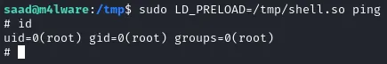

And we are root!

The root flag can be found at /root/root.txt!